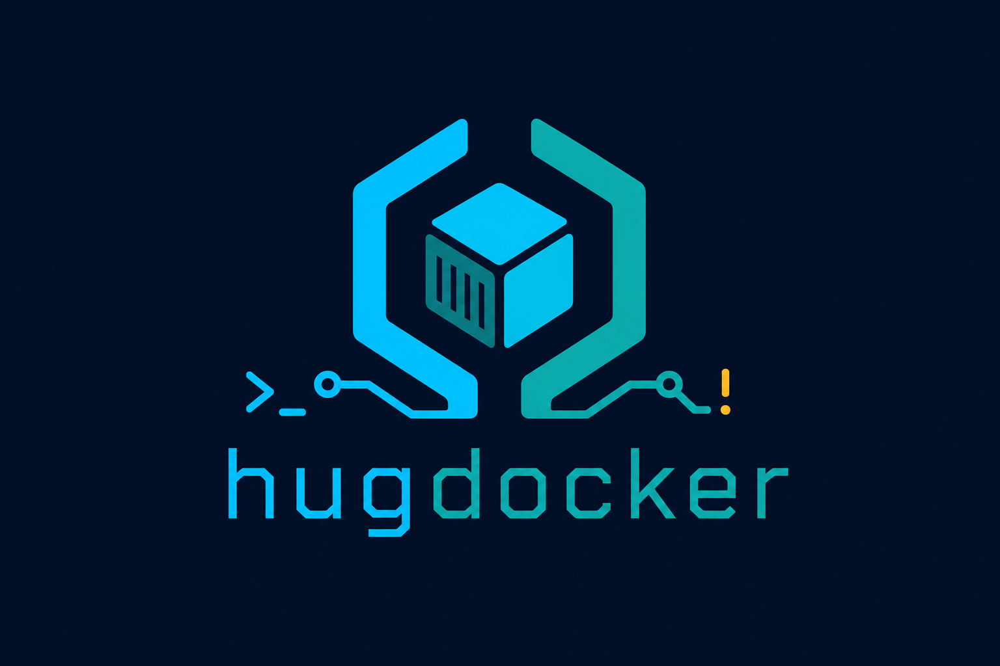
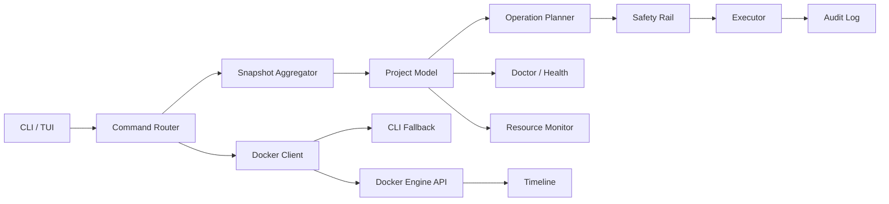
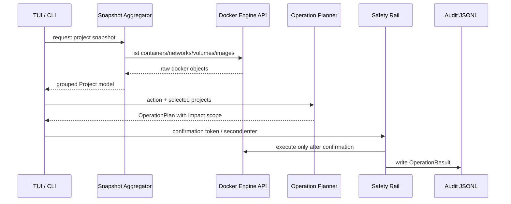

# hugdocker

<div align="center">



**Project-first Docker operations cockpit for Linux terminals.**

面向 Linux 日常运维的高性能 Docker TUI/CLI。以项目为中心聚合 Compose、Stack 和 standalone 容器，提供资源监控、风险预演、安全执行、异常恢复、审计时间线和脚本化 JSON 输出。

[](https://github.com/badwichell007/hugdocker/actions/workflows/ci.yml)
[](https://github.com/badwichell007/hugdocker/releases)
[](https://www.rust-lang.org/)
[](https://ratatui.rs/)
[](https://github.com/fussybeaver/bollard)
[](LICENSE)

`hugdocker` is not another container list. It is a local ops control plane for project-scoped Docker work.

</div>

---

## 目录

- [为什么做 hugdocker](#为什么做-hugdocker)
- [界面预览](#界面预览)
- [核心能力](#核心能力)
- [快速安装](#快速安装)
- [快速开始](#快速开始)
- [TUI 使用教程](#tui-使用教程)
- [CLI 使用教程](#cli-使用教程)
- [配置](#配置)
- [技术架构](#技术架构)
- [JSON 输出](#json-输出)
- [安全模型](#安全模型)
- [与其他工具的区别](#与其他工具的区别)
- [更新路线](#更新路线)
- [更新日志](#更新日志)
- [开发](#开发)

## 为什么做 hugdocker

很多 Docker 工具要么偏 Web 控制台，要么偏指标看板，要么只是把 `docker ps` 做成列表。`hugdocker` 的目标更窄，也更贴近日常：把 Docker 管理抽象成“项目级动作流”。

```text
select project -> inspect risk -> preview operation -> confirm safely -> audit result
```

它关注的不是“展示所有 Docker 对象”，而是让你在终端里更快完成这些日常动作：

- 这个 Compose 项目现在健康吗？
- 哪些容器 unhealthy、restarting、paused？
- 删除或 purge 会影响哪些 container、network、volume、image？
- 当前项目 CPU、内存、网络、IO 是否异常？
- 出问题时能否一键生成恢复预案，而不是手动拼命令？
- 批量操作能否先 dry-run，再安全执行，并留下审计记录？

设计原则：

| 原则 | 含义 |
| --- | --- |
| Project-first | 日常运维关心的是项目状态，而不是孤立容器行 |
| Preview-before-mutate | 所有修改动作先生成 Operation Plan，再进入确认和执行 |
| Read-heavy, mutate-carefully | 查看、诊断、监控要快；删除、purge、prune 必须慢下来确认 |
| Low idle cost | TUI 空闲时不高频重绘，资源视图不做全局轮询 |
| Scriptable by default | 人用 TUI，脚本用 JSON；两者复用同一套核心模型 |

## 界面预览

```text
╭──────────────────────────── OPS COCKPIT / HUGDOCKER ─────────────────────────────╮
│ LIVE docker socket | mode:all selected:0 sort:Severity filter:none               │
╰──────────────────────────────────────────────────────────────────────────────────╯
╭ Projects / Risk Radar ────────────╮ ╭ Ops Deck / Resources / Resource Monitor ─╮
│ Sel State Project       Run Ports │ │ KPI CPU   12.5%     KPI MEM 48.1%        │
│ [x] [UP]  edge          2/2 1     │ │ KPI NET   4.2Mi/1M  KPI IO 163Mi/42Mi    │
│ [ ] [RSTR] api-gateway  1/1 1     │ │ Resource Monitor | edge | refreshing     │
│ [ ] [PAUS] postgres-dev 1/1 1     │ │ State Container      CPU   MEM  NET  IO  │
│ right-click: manage project       │ │ UP    edge_web_1    12.5% 25.0% rx/tx    │
╰───────────────────────────────────╯ ╰──────────────────────────────────────────╯
╭ Command Bar / Fast Ops ─────────────────────────────────────────────────────────╮
│ mouse: click row select, right-click manage | m resources | Enter execute        │
╰──────────────────────────────────────────────────────────────────────────────────╯
```

## 核心能力

| 模块 | 能力 | 设计目标 |
| --- | --- | --- |
| Project View | 自动识别 Compose、Stack、Standalone | 以项目而不是单个容器作为日常操作单元 |
| Ops Inbox | 汇总 Critical、Resource Pressure、Cleanup、Next Action | 打开 TUI 后直接知道最该处理什么 |
| TUI Command Center | 键盘、鼠标、右键菜单、多选、过滤、排序 | 保持终端速度，同时降低误操作成本 |
| Resource Monitor | 当前项目级 CPU/MEM/NET/IO 实时采样 | 只在进入资源视图时采样，避免全局轮询拖慢 TUI |
| Operation Plan | start/stop/restart/remove/purge/prune 风险预演 | 所有修改动作先生成计划，再执行 |
| Safety Rail | typed confirmation、dry-run、强确认 token | 删除、purge、prune 等危险动作不允许无脑执行 |
| Doctor | unhealthy、restarting、paused、端口冲突等诊断 | 快速发现项目级风险 |
| Rescue | Recovery Playbook | 对异常项目生成恢复型重启预案 |
| Timeline | Docker events 摘要记录 | 为本地排障保留轻量时间线 |
| JSON API | `list`、`inspect`、`doctor`、`health`、`plan` 等 | 让 CLI 可以进入 shell、CI 和自动化脚本 |

## 快速安装

### 一行安装

```bash
curl -fsSL https://raw.githubusercontent.com/badwichell007/hugdocker/main/scripts/install.sh | bash
```

默认安装位置：

```text
~/.local/bin/hugdocker
```

如果命令不可见：

```bash
export PATH="$HOME/.local/bin:$PATH"
```

### 指定版本

```bash
HUGDOCKER_VERSION=v0.5.1 curl -fsSL https://raw.githubusercontent.com/badwichell007/hugdocker/main/scripts/install.sh | bash
```

### 源码安装

需要 Rust toolchain。

```bash
git clone https://github.com/badwichell007/hugdocker.git hugdocker
cd hugdocker
cargo build --release
bash ./scripts/install-cli.sh
```

### 卸载

```bash
bash ./scripts/uninstall-cli.sh
```

### Shell 补全

Bash：

```bash
mkdir -p ~/.local/share/bash-completion/completions
hugdocker completion bash > ~/.local/share/bash-completion/completions/hugdocker
```

Zsh：

```bash
mkdir -p ~/.zfunc
hugdocker completion zsh > ~/.zfunc/_hugdocker
```

Fish：

```bash
mkdir -p ~/.config/fish/completions
hugdocker completion fish > ~/.config/fish/completions/hugdocker.fish
```

## 快速开始

启动 TUI：

```bash
hugdocker
```

列出项目：

```bash
hugdocker list
hugdocker list --json
```

查看详情：

```bash
hugdocker inspect myapp
hugdocker inspect myapp --json
```

先预演，再执行：

```bash
hugdocker plan restart myapp
hugdocker restart myapp --dry-run
hugdocker restart myapp --yes
```

诊断和恢复：

```bash
hugdocker doctor
hugdocker health --json
hugdocker rescue myapp --dry-run
```

远程 Docker context：

```bash
hugdocker context ls
hugdocker context current
hugdocker --context staging list
hugdocker --host tcp://127.0.0.1:2375 doctor
```

日志和资源采样：

```bash
hugdocker logs <container-id-or-name> --tail 200
hugdocker logs <container-id-or-name> --tail 200 --follow
hugdocker logs <container-id-or-name> --filter error
hugdocker stats <container-id-or-name>
hugdocker stats <container-id-or-name> --json
```

安全清理和时间线：

```bash
hugdocker safe-prune --dry-run
hugdocker safe-prune --confirm-token PRUNE
hugdocker timeline --tail 100
hugdocker timeline --watch
```

常用动作面：

| 目标 | 命令 |
| --- | --- |
| 进入 TUI | `hugdocker` |
| 运维收件箱 | `hugdocker inbox --json` |
| 项目清单 | `hugdocker list --json` |
| 风险诊断 | `hugdocker doctor --json` |
| 资源采样 | `hugdocker stats <container> --json` |
| 操作预演 | `hugdocker plan restart myapp --json` |
| 异常恢复 | `hugdocker rescue myapp --dry-run` |
| 安全清理 | `hugdocker safe-prune --dry-run` |
| 事件时间线 | `hugdocker timeline --tail 100` |
| 本地配方 | `hugdocker recipes --json` |

## TUI 使用教程

运行：

```bash
hugdocker
```

TUI 采用 Ops Cockpit 布局：

| 区域 | 说明 |
| --- | --- |
| Header | 当前运行模式、排序方式、过滤条件、选中数量、LIVE 状态 |
| KPI Strip | 项目总数、活动项目、风险项目、已选项目、当前可见项目 |
| Projects / Risk Radar | 项目列表，强化 State、Risk、Active、Ports 和选择状态 |
| Ops Deck | Ops Inbox、详情、诊断、日志入口、资源监视、风险预演、恢复预案 |
| Command Bar / Fast Ops | 当前状态、快捷键和执行提示 |

### Ops Inbox

TUI 默认打开 `Ops Inbox`。它会把当前快照中的运维信号整理成待处理队列：

| 类别 | 说明 |
| --- | --- |
| Critical | unhealthy、restarting、paused 等项目状态风险 |
| Resource Pressure | 当前资源采样中的高 CPU、高内存和 stats error |
| Cleanup | stopped containers 等可先 dry-run 的清理机会 |
| Next Action | 推荐下一条安全命令，例如 `hugdocker rescue <project> --dry-run` |

Inbox 只提供建议和安全预演命令，不直接执行修改操作。按 `b` 可随时回到 Inbox。

### 鼠标操作

| 操作 | 行为 |
| --- | --- |
| 左键点击项目行 | 选择或反选项目 |
| 右键点击项目行 | 打开项目管理菜单 |
| 鼠标移动到菜单项 | 高亮当前菜单选择 |
| 左键点击菜单项 | 进入详情、诊断、日志、资源、容器 shell 或操作预演 |
| 鼠标滚轮 | 移动项目光标 |

右键菜单：

```text
Inspect
Doctor
Start
Stop
Restart
Rescue
Logs
Resources
Exec
Remove
Purge
```

`Exec` 会先打开 active 容器选择器，再临时退出 TUI 全屏界面执行 `docker exec -it <container> <shell>`；shell 按 `sh -> bash -> ash` fallback，退出后自动回到 TUI。

选中的项目会显示 `[x]`、黄色加粗和暗色背景。即使光标移动到其他项目，已选状态仍保留，避免“选中了但看不出来”。

### 键盘快捷键

```text
j/k 或 ↑/↓    移动项目光标
space         选择/反选当前项目
a             全选/反选当前视图
c             清空选择
/             输入过滤关键字
Backspace     删除过滤字符
x             仅显示活动项目
o             切换排序
r             刷新快照
b             inbox 面板
i             详情面板
d             doctor 面板
l             logs 面板
m             resources 面板
:             command palette 面板
e             exec 容器选择器
u             update 预案
1             start 预演
2             stop 预演
3             restart 预演
4             remove 预演
5             purge 预演
Enter         在预演面板打开执行确认
h 或 ?        帮助
q 或 Esc      退出或取消当前确认
```

### Resource Monitor

按 `m` 打开项目级资源监视图。

资源页只采样当前选中项目的 active containers，不做全局轮询。进入资源页后会后台 one-shot 采样 Docker stats，TUI 主循环不等待采样完成，避免键鼠卡顿。

资源页展示：

| 指标 | 内容 |
| --- | --- |
| CPU | 当前项目容器 CPU 百分比汇总，超过阈值会高亮 |
| MEM | 内存使用率和使用量/限制，接近上限会高亮 |
| NET | 网络 RX/TX 汇总 |
| IO | block read/write 汇总和 stats 错误提示 |
| Containers | 每个容器的 State、CPU、MEM%、NET rx/tx、IO r/w |

刷新时会保留上一帧数据，并显示 `refreshing` 状态，避免资源页闪烁。

### TUI 内执行

TUI 执行流程是“预演优先”：

```text
选择项目 -> 选择动作 -> 生成 Operation Plan -> 确认 -> 执行 -> 审计
```

普通动作：

```text
Start / Stop / Restart / Rescue
```

危险动作：

```text
Remove / Purge / Prune
```

危险动作会显示 `Safety Rail`，并要求输入确认令牌。鼠标点击不会直接执行删除或完全删除。

## CLI 使用教程

### 查看项目

```bash
hugdocker list
hugdocker running
hugdocker inspect myapp
```

JSON 输出：

```bash
hugdocker list --json
hugdocker running --json
hugdocker inspect myapp --json
```

### 启动、停止、重启

建议先 dry-run：

```bash
hugdocker start myapp --dry-run
hugdocker stop myapp --dry-run
hugdocker restart myapp --dry-run
```

确认后执行：

```bash
hugdocker start myapp --yes
hugdocker stop myapp --yes
hugdocker restart myapp --yes
```

批量操作：

```bash
hugdocker stop app1 app2 app3 --dry-run
hugdocker restart app1 app2 app3 --yes
```

### 删除和完全删除

删除项目但保留卷和镜像：

```bash
hugdocker plan remove myapp
hugdocker remove myapp
```

完全删除项目，包括卷和镜像：

```bash
hugdocker plan purge myapp
hugdocker purge myapp
hugdocker purge myapp --confirm-token DELETE-myapp
```

`remove` 和 `purge` 会展示影响范围并要求确认令牌。例如：

```text
确认令牌: DELETE-myapp
```

脚本化执行时，`remove` 可以使用 `--yes` 跳过交互确认；`purge` 不允许只用 `--yes`，必须显式传入 `--confirm-token`。

### 安全清理

查看 safe-prune 计划：

```bash
hugdocker safe-prune --dry-run
```

执行 safe-prune：

```bash
hugdocker safe-prune --confirm-token PRUNE
```

`safe-prune` 只处理 stopped containers、unused networks 和 dangling images；volumes 默认排除，避免误删持久化数据。

### 诊断和恢复

检查 Docker 环境：

```bash
hugdocker health
hugdocker health --json
```

检查项目异常：

```bash
hugdocker doctor
hugdocker doctor --json
```

恢复异常项目：

```bash
hugdocker rescue myapp --dry-run
hugdocker rescue myapp --yes
```

`rescue` 会优先处理 unhealthy、restarting、active 容器，并生成恢复重启预案。

### 日志、指标和时间线

```bash
hugdocker logs <container-id-or-name> --tail 200
hugdocker logs <container-id-or-name> --tail 200 --follow
hugdocker logs <container-id-or-name> --filter error
hugdocker stats <container-id-or-name>
hugdocker stats <container-id-or-name> --json
hugdocker timeline --tail 100
hugdocker timeline --watch
```

### Compose 和安全更新

```bash
hugdocker compose myapp pull --dry-run
hugdocker compose myapp pull --yes
hugdocker compose myapp up web --yes
hugdocker compose myapp rebuild api --yes
hugdocker compose myapp restart --yes
hugdocker compose myapp watch --yes
hugdocker compose myapp diff --dry-run
hugdocker compose myapp rollback api --dry-run
hugdocker update myapp --dry-run
hugdocker update myapp --yes
```

`compose` 覆盖 `pull/up/down/rebuild/restart/watch/diff/rollback` 常用动作；`diff` 映射到 `docker compose config`，用于查看最终配置；`rollback` 当前是轻量恢复入口，映射到 `up -d --force-recreate`，适合镜像回退后重建指定服务。

`update` 输出 `pull -> restart plan -> doctor hint`，先复用 Operation Plan 展示影响范围，再执行 restart。

### Docker Context 和远程单机

查看 Docker contexts：

```bash
hugdocker context ls
hugdocker context ls --json
hugdocker context current
```

临时指定远程 context：

```bash
hugdocker --context staging list
hugdocker --context staging doctor
hugdocker --context staging compose myapp pull --dry-run
```

临时指定 Docker host：

```bash
hugdocker --host unix:///var/run/docker.sock list
hugdocker --host tcp://127.0.0.1:2375 health
```

也可以写入配置文件：

```toml
[docker]
context = "staging"
# host = "tcp://127.0.0.1:2375"
```

`--host` 优先级高于 `--context`。API 路径使用 Docker Engine endpoint，Compose 路径会把 `--context` 或 `--host` 透传给 Docker CLI，因此 dry-run 输出可以直接复制执行。

### 审计导出

默认状态文件：

```text
~/.local/state/hugdocker/audit.log
~/.local/state/hugdocker/timeline.jsonl
```

导出最近审计记录：

```bash
hugdocker audit export
hugdocker audit export --tail 500
hugdocker audit export --tail 500 --json
```

`audit export` 不需要 Docker daemon，适合把本地操作记录接入 `jq`、ELK、备份脚本或故障复盘。

### Profiles 和 Recipes

```bash
hugdocker profiles
hugdocker profiles --json
hugdocker recipes
hugdocker recipes --json
```

## 配置

生成默认配置：

```bash
hugdocker init-config
```

配置路径：

```text
~/.config/hugdocker/config.toml
```

示例：

```toml
[docker]
# context = "default"
# host = "tcp://127.0.0.1:2375"

[tui]
refresh_ms = 2000
log_tail = 200
default_filter = ""
theme = "cockpit"

[safety]
typed_confirmation = true
allow_yes_for_purge = false

[group_exact]
"mcphub" = "devtools"

[group_prefix]
"redis-" = "cache"
"postgres-" = "database"

[group_image_prefix]
"redis:" = "cache"
"postgres:" = "database"

[profiles.groups]
"frontend" = ["web*", "nginx*"]
"data" = ["postgres*", "redis*", "mysql*"]
"ops" = ["grafana*", "prometheus*", "loki*"]
```

配置后，standalone 容器会按容器名或镜像名前缀归到对应项目组。
`profiles.groups` 支持精确匹配和尾部 `*` 前缀匹配，用来把 Compose、Stack 或 standalone 项目按业务域输出到 `hugdocker profiles`。

## 技术架构

`hugdocker` 默认走 Docker Engine API，本地 Docker socket 优先；也支持通过 `--context`、`DOCKER_CONTEXT`、`--host`、`DOCKER_HOST` 连接远程单机 Docker endpoint。CLI fallback 只用于 Compose、shell exec 等 Docker API 不适合直接承载的交互场景。



运行时数据流：



核心模块：

| 模块 | 职责 |
| --- | --- |
| `cli` | clap 命令入口、JSON 输出、脚本化参数 |
| `docker` | Docker API 后端、stats/logs/events、CLI fallback |
| `domain` | Project、Container、Snapshot、OperationAction 等核心模型 |
| `ops` | OperationPlan 和执行器 |
| `health` | 项目和全局诊断 |
| `resources` | CPU/MEM/NET/IO 采样模型和聚合 |
| `tui` | ratatui/crossterm 事件循环、布局、鼠标和确认流 |
| `audit` | JSONL 审计日志 |
| `telemetry` | Docker events 时间线 |
| `config` | TOML 配置、主题和分组规则 |

性能策略：

- 快照聚合一次读取 containers、networks、volumes、images。
- Docker context 只在启动或命令入口解析 endpoint，不在 TUI 主循环重复调用 Docker CLI。
- TUI 主循环采用事件驱动 redraw，避免空闲高频重绘。
- Resource Monitor 只在资源页采样当前项目，不全局轮询。
- stats 采样通过后台 one-shot task 执行，避免阻塞按键和鼠标。
- Docker events 摘要写入 timeline，便于后续排障。

质量门禁：

| 检查 | 命令 |
| --- | --- |
| 编译检查 | `cargo check --all-targets` |
| 单元和集成测试 | `cargo test --all-targets` |
| Release 构建 | `cargo build --release` |
| 脚本语法 | `bash -n scripts/install.sh scripts/install-cli.sh scripts/uninstall-cli.sh scripts/open-menu.sh` |

## JSON 输出

以下命令提供稳定 JSON 输出，字段使用 `snake_case`：

```bash
hugdocker list --json
hugdocker running --json
hugdocker inspect <project> --json
hugdocker doctor --json
hugdocker health --json
hugdocker plan <action> <project...> --json
hugdocker profiles --json
hugdocker recipes --json
hugdocker audit export --json
```

适用场景：

| 场景 | 示例 |
| --- | --- |
| Shell 自动化 | `hugdocker list --json | jq ...` |
| CI 诊断 | `hugdocker health --json` |
| 批量预演 | `hugdocker plan restart app1 app2 --json` |
| 运维审计 | `hugdocker audit export --tail 500 --json` |

## 安全模型

`hugdocker` 对修改型操作采用同一套执行模型：

```text
OperationAction -> OperationPlan -> Confirmation -> Executor -> Audit
```

安全约束：

- `--dry-run` 默认可用于所有修改型操作。
- `remove`、`purge`、`prune` 会展示影响范围。
- `purge` 不允许仅靠 `--yes` 执行，必须提供确认令牌。
- TUI 中危险动作必须输入面板显示的 token。
- 鼠标菜单只打开预演，不直接删除资源。
- 执行结果写入 JSONL audit log。

## 与其他工具的区别

| 工具类型 | 常见侧重点 | hugdocker 的不同点 |
| --- | --- | --- |
| 通用 Docker TUI | 容器列表、日志、基础操作 | 项目级动作流、风险预演、安全确认 |
| 资源监控工具 | CPU、内存、网络实时指标 | 指标只是入口之一，同时覆盖诊断、恢复、审计 |
| Web 管理平台 | 多节点 Web UI、Agent/Server | 本地单二进制，终端优先，无需服务端 |
| Bash 脚本 | 简单命令封装 | 强类型模型、JSON 输出、TUI、测试覆盖和安全执行路径 |

## 更新路线

`hugdocker` 的路线会继续围绕“本地 Docker 日常运维 cockpit”推进，不追求做成重量级 Web 平台。

### v0.4.0 已完成

- 主命令升级为 `hugdocker`，并保留 `dockerctl` 兼容入口。
- 引入 Ops Fingerprint，把项目风险转成风险分、信号列表和下一步建议命令。
- Doctor、Health、TUI Doctor 和 Ops Inbox 复用同一套风险指纹模型。
- 配置路径迁移到 `hugdocker`，同时读取旧 `dockerctl` 配置。

### v0.5.0 已完成

- 支持 Docker contexts：`hugdocker --context staging list`、`hugdocker context ls/current`。
- 支持显式 Docker host：`hugdocker --host tcp://127.0.0.1:2375 doctor`，并可写入 `[docker]` 配置。
- Compose 工作流扩展到 `watch/diff/rollback`，dry-run 输出可直接复制执行。
- 新增 `audit export`，把本地 JSONL 审计记录变成可脚本化导出入口。
- Docker API 连接复用 bollard host 解析，减少手写 endpoint 分支，保留本地 socket 默认体验。

### v0.5.x

- 增强 Profiles：支持更丰富的业务域筛选、隐藏规则和 TUI 内 profile 切换。
- 增强 Recipes：支持用户本地 TOML 配方，并继续复用 OperationPlan 安全执行。
- 增强 Timeline：把 Docker events、操作审计和健康变化聚合成更可读的事件流。
- 增强日志面板：TUI 内按容器切换、过滤关键字、高亮 error/warn，并避免日志拉取阻塞 UI。
- 增加可选历史指标文件，用于轻量趋势分析，不默认开启后台采集。
- 探索 Podman 兼容层，但不牺牲 Docker-first 的稳定性。
- 加强安装体验：更多发行版预编译包、校验说明、自动补全安装和仓库重命名迁移说明。

### 长期方向

- 保持单二进制、无服务端、终端优先。
- 继续强化“预演再执行”的安全模型。
- 让 TUI 既适合日常使用，也适合 README、Release、演示和传播。
- 优先做好本地 Docker 运维，不把项目扩张成复杂平台。

## 更新日志

### v0.5.1

- 修复 TUI Logs 面板：从只显示日志命令提示升级为直接后台加载当前容器 tail 日志。
- Logs 面板支持 `n/p` 切换容器后重新加载日志，并复用当前过滤关键字。
- 新增 loading、empty、error 状态显示，避免用户点开 Logs 后看不到真实日志。
- 保持 CLI `hugdocker logs <container>` 行为不变。

### v0.5.0

- 新增 Docker context 支持：`--context`、`DOCKER_CONTEXT`、`hugdocker context ls`、`hugdocker context current`。
- 新增 Docker host 支持：`--host`、`DOCKER_HOST` 和 `[docker] host/context` 配置，适合远程单机 Docker endpoint。
- Compose 工作流新增 `watch`、`diff`、`rollback`；dry-run 会显示包含 `--context` 或 `--host` 的真实预览命令。
- 新增 `hugdocker audit export`，支持 `--tail` 和 `--json`，不用连接 Docker daemon 也能导出本地审计。
- Docker API 连接改为复用 bollard host 解析，减少 endpoint 兼容分支，继续保持本地 socket 默认体验。

### v0.4.4

- TUI `Exec` 从“默认第一个 active 容器”升级为 active 容器选择器，支持 `sh -> bash -> ash` shell fallback。
- 新增 `:` Command Palette 面板，集中展示当前项目的 logs、compose、update、doctor 高频命令。
- `logs` 支持 `--follow` 和 `--filter`，并对 error/warn/panic/fatal 做终端高亮。
- 新增 `compose` 子命令，覆盖 `pull/up/down/rebuild/restart`，默认 dry-run 可预览，执行需 `--yes`。
- 新增 `update` 子命令，提供 `pull -> restart plan -> doctor hint` 的安全更新流。
- Doctor 新增安全信号：privileged、Docker socket 挂载、host network、root 用户、敏感目录挂载，并进入 Ops Fingerprint 风险分。

### v0.4.3

- TUI 右键菜单新增 `Exec`，可直接进入当前项目第一个 active 容器。
- Exec 会临时退出 TUI 全屏界面并运行 `docker exec -it <container> sh`，退出 shell 后自动回到 TUI。

### v0.4.2

- Ops Fingerprint 新增 `stale_stopped:<n>`，识别停留多天、周、月、年的 stopped 容器，并建议先执行 `hugdocker safe-prune --dry-run`。
- Ops Fingerprint 新增 `shared_volume:<name>`，识别跨项目共享 volume，帮助用户在 remove/purge 前发现潜在数据风险。

### v0.4.1

- Ops Fingerprint 现在会把跨项目端口冲突归因到每个相关项目，输出 `port_conflict:<port>` 信号。
- 端口冲突会进入风险分计算，并通过 `doctor`、`health --json`、TUI Doctor 和 Ops Inbox 同步呈现。

### v0.4.0

- 项目主品牌和主二进制升级为 `hugdocker`，旧 `dockerctl` 继续作为兼容命令和安装软链保留。
- 新增项目级 Ops Fingerprint：把 unhealthy、restart loop、公网监听、匿名卷、端口冲突、镜像膨胀等信号压成风险分和下一条建议命令。
- `hugdocker doctor --json` 和 `hugdocker health --json` 增加 `fingerprints` 字段，方便脚本和 CI 直接读取高风险项目。
- TUI Doctor 面板新增 Risk Fingerprints 区块，打开界面即可看到最高风险项目、信号和下一步命令。
- Ops Inbox 接入 Risk Fingerprint，优先展示最该处理的项目，而不是只展示静态容器状态。
- 配置和状态目录默认迁移到 `~/.config/hugdocker`、`~/.local/state/hugdocker`，同时兼容读取旧 `~/.config/dockerctl/config.toml`。
- Release 包名升级为 `hugdocker-<target>.tar.gz`，包内仍包含 `dockerctl -> hugdocker` 兼容入口。

### v0.3.0

- 移除 `hugdocker demo`，回到真实 Docker socket 优先的本地运维工具定位。
- 新增 `hugdocker inbox`，把 TUI Ops Inbox 的优先级动作队列开放给 CLI 和 JSON 自动化。
- Resource Monitor 增加压力排序、hotspot 提示和项目级相邻采样趋势，高 CPU、高内存、stats error 优先展示。
- Log Lens 升级为专用面板，展示当前容器、关键字过滤、`n/p` 容器切换和 error/warn/panic 高亮规则。
- Doctor 增强端口冲突、公网监听、匿名卷、孤儿网络/卷、镜像膨胀、restart loop 和 standalone 自定义网络提示。
- Ops Cockpit 优化窄屏左右栏密度，右键菜单增加明确选中标记，鼠标管理状态更直观。
- Recipes 改为稳定模型输出，提供 panic-stop、rescue-unhealthy、preflight-delete、safe-cleanup。
- Profiles 支持 `[profiles.groups]` 自定义项目分组匹配，便于按业务域组织 standalone 容器。
- Timeline CLI 将 JSONL 事件格式化为更可读的事件流。

### v0.2.2

- 新增 Ops Inbox：默认面板直接汇总 Critical、Resource Pressure、Cleanup 和 Next Action。
- 新增独立 `inbox` 模型：从 Docker snapshot 和当前资源采样生成可测试的待处理队列。
- TUI 新增 `b` 快捷键，用户可以从任意面板快速回到 Inbox。
- README 增加 Ops Inbox 教程，强调“打开就知道下一步该处理什么”。

### v0.2.1

- TUI 默认升级为 `cockpit` 主题：Header、KPI Strip、Projects / Risk Radar、Ops Deck 和 Command Bar 统一为 Ops Cockpit 视觉层级。
- Resource Monitor 视觉增强：CPU/MEM/NET/IO 改为 cockpit KPI 指标块，loading、empty、error、refreshing 状态更直观。
- 信息架构优化：Header 显示运行模式、sort、filter、selection；项目表强化 state、risk、active、ports。

### v0.2.0

- 增强 TUI 资源监视图：进入 `Resources` 后按当前项目采样 CPU、内存、网络和 IO。
- 优化资源页显示：新增 CPU/MEM/NET/IO 摘要卡片，容器表格合并为 `NET rx/tx` 和 `IO r/w`。
- 修复资源页闪烁：空闲状态不再高频重绘，刷新采样时保留上一帧数据并显示 `refreshing`。
- 增强鼠标体验：项目列表支持点击选择，右键菜单支持管理动作和菜单项高亮。
- 加强危险操作保护：删除、purge、prune 等动作继续走风险预演和确认令牌。

## 开发

```bash
cargo test --all-targets
cargo check --all-targets
cargo build --release
```

格式化：

```bash
rustup component add rustfmt
cargo fmt
cargo fmt --check
```

安装本地构建：

```bash
bash ./scripts/install-cli.sh
```

卸载本地构建：

```bash
bash ./scripts/uninstall-cli.sh
```

## License

MIT
