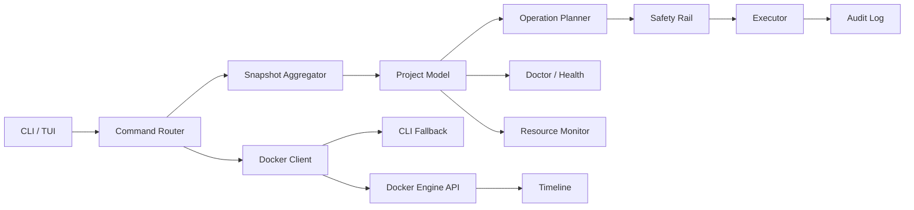
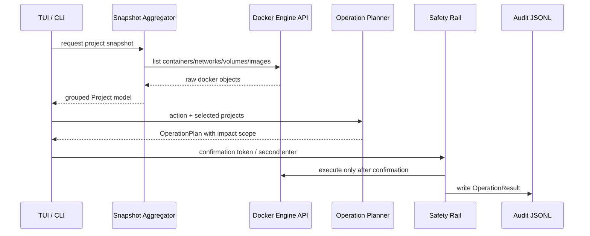

# dockerctl

<div align="center">

**Project-first Docker operations cockpit for Linux terminals.**

面向 Linux 日常运维的高性能 Docker TUI/CLI。以项目为中心聚合 Compose、Stack 和 standalone 容器，提供资源监控、风险预演、安全执行、异常恢复、审计时间线和脚本化 JSON 输出。

[](https://github.com/badwichell007/dockerctl/actions/workflows/ci.yml)
[](https://github.com/badwichell007/dockerctl/releases)
[](https://www.rust-lang.org/)
[](https://ratatui.rs/)
[](https://github.com/fussybeaver/bollard)
[](LICENSE)

`dockerctl` is not another container list. It is a local ops control plane for project-scoped Docker work.

</div>

---

## 目录

- [为什么做 dockerctl](#为什么做-dockerctl)
- [界面预览](#界面预览)
- [核心能力](#核心能力)
- [快速安装](#快速安装)
- [快速开始](#快速开始)
- [TUI 使用教程](#tui-使用教程)
- [CLI 使用教程](#cli-使用教程)
- [配置](#配置)
- [技术架构](#技术架构)
- [JSON 输出](#json-输出)
- [安全模型](#安全模型)
- [与其他工具的区别](#与其他工具的区别)
- [更新路线](#更新路线)
- [更新日志](#更新日志)
- [开发](#开发)

## 为什么做 dockerctl

很多 Docker 工具要么偏 Web 控制台，要么偏指标看板，要么只是把 `docker ps` 做成列表。`dockerctl` 的目标更窄，也更贴近日常：把 Docker 管理抽象成“项目级动作流”。

```text
select project -> inspect risk -> preview operation -> confirm safely -> audit result
```

它关注的不是“展示所有 Docker 对象”，而是让你在终端里更快完成这些日常动作：

- 这个 Compose 项目现在健康吗？
- 哪些容器 unhealthy、restarting、paused？
- 删除或 purge 会影响哪些 container、network、volume、image？
- 当前项目 CPU、内存、网络、IO 是否异常？
- 出问题时能否一键生成恢复预案，而不是手动拼命令？
- 批量操作能否先 dry-run，再安全执行，并留下审计记录？

设计原则：

| 原则 | 含义 |
| --- | --- |
| Project-first | 日常运维关心的是项目状态，而不是孤立容器行 |
| Preview-before-mutate | 所有修改动作先生成 Operation Plan，再进入确认和执行 |
| Read-heavy, mutate-carefully | 查看、诊断、监控要快；删除、purge、prune 必须慢下来确认 |
| Low idle cost | TUI 空闲时不高频重绘，资源视图不做全局轮询 |
| Scriptable by default | 人用 TUI，脚本用 JSON；两者复用同一套核心模型 |

## 界面预览

```text
╭──────────────────────────── OPS COCKPIT / DOCKERCTL ─────────────────────────────╮
│ LIVE docker socket | mode:all selected:0 sort:Severity filter:none               │
╰──────────────────────────────────────────────────────────────────────────────────╯
╭ Projects / Risk Radar ────────────╮ ╭ Ops Deck / Resources / Resource Monitor ─╮
│ Sel State Project       Run Ports │ │ KPI CPU   12.5%     KPI MEM 48.1%        │
│ [x] [UP]  edge          2/2 1     │ │ KPI NET   4.2Mi/1M  KPI IO 163Mi/42Mi    │
│ [ ] [RSTR] api-gateway  1/1 1     │ │ Resource Monitor | edge | refreshing     │
│ [ ] [PAUS] postgres-dev 1/1 1     │ │ State Container      CPU   MEM  NET  IO  │
│ right-click: manage project       │ │ UP    edge_web_1    12.5% 25.0% rx/tx    │
╰───────────────────────────────────╯ ╰──────────────────────────────────────────╯
╭ Command Bar / Fast Ops ─────────────────────────────────────────────────────────╮
│ mouse: click row select, right-click manage | m resources | Enter execute        │
╰──────────────────────────────────────────────────────────────────────────────────╯
```

## 核心能力

| 模块 | 能力 | 设计目标 |
| --- | --- | --- |
| Project View | 自动识别 Compose、Stack、Standalone | 以项目而不是单个容器作为日常操作单元 |
| TUI Command Center | 键盘、鼠标、右键菜单、多选、过滤、排序 | 保持终端速度，同时降低误操作成本 |
| Resource Monitor | 当前项目级 CPU/MEM/NET/IO 实时采样 | 只在进入资源视图时采样，避免全局轮询拖慢 TUI |
| Operation Plan | start/stop/restart/remove/purge/prune 风险预演 | 所有修改动作先生成计划，再执行 |
| Safety Rail | typed confirmation、dry-run、强确认 token | 删除、purge、prune 等危险动作不允许无脑执行 |
| Doctor | unhealthy、restarting、paused、端口冲突等诊断 | 快速发现项目级风险 |
| Rescue | Recovery Playbook | 对异常项目生成恢复型重启预案 |
| Timeline | Docker events 摘要记录 | 为本地排障保留轻量时间线 |
| JSON API | `list`、`inspect`、`doctor`、`health`、`plan` 等 | 让 CLI 可以进入 shell、CI 和自动化脚本 |

## 快速安装

### 一行安装

```bash
curl -fsSL https://raw.githubusercontent.com/badwichell007/dockerctl/main/scripts/install.sh | bash
```

默认安装位置：

```text
~/.local/bin/dockerctl
```

如果命令不可见：

```bash
export PATH="$HOME/.local/bin:$PATH"
```

### 指定版本

```bash
DOCKERCTL_VERSION=v0.2.1 curl -fsSL https://raw.githubusercontent.com/badwichell007/dockerctl/main/scripts/install.sh | bash
```

### 源码安装

需要 Rust toolchain。

```bash
git clone https://github.com/badwichell007/dockerctl.git
cd dockerctl
cargo build --release
bash ./scripts/install-cli.sh
```

### 卸载

```bash
bash ./scripts/uninstall-cli.sh
```

### Shell 补全

Bash：

```bash
mkdir -p ~/.local/share/bash-completion/completions
dockerctl completion bash > ~/.local/share/bash-completion/completions/dockerctl
```

Zsh：

```bash
mkdir -p ~/.zfunc
dockerctl completion zsh > ~/.zfunc/_dockerctl
```

Fish：

```bash
mkdir -p ~/.config/fish/completions
dockerctl completion fish > ~/.config/fish/completions/dockerctl.fish
```

## 快速开始

启动 TUI：

```bash
dockerctl
```

无 Docker 环境先体验高级界面：

```bash
dockerctl demo
```

`demo` 使用内置 mock snapshot 和 mock resource data，不连接 Docker daemon，不执行真实 start/stop/restart/remove/purge/prune，也不会写入真实审计日志。

列出项目：

```bash
dockerctl list
dockerctl list --json
```

查看详情：

```bash
dockerctl inspect myapp
dockerctl inspect myapp --json
```

先预演，再执行：

```bash
dockerctl plan restart myapp
dockerctl restart myapp --dry-run
dockerctl restart myapp --yes
```

诊断和恢复：

```bash
dockerctl doctor
dockerctl health --json
dockerctl rescue myapp --dry-run
```

日志和资源采样：

```bash
dockerctl logs <container-id-or-name> --tail 200
dockerctl stats <container-id-or-name>
dockerctl stats <container-id-or-name> --json
```

安全清理和时间线：

```bash
dockerctl safe-prune --dry-run
dockerctl safe-prune --confirm-token PRUNE
dockerctl timeline --tail 100
dockerctl timeline --watch
```

常用动作面：

| 目标 | 命令 |
| --- | --- |
| 进入 TUI | `dockerctl` |
| Demo 体验 | `dockerctl demo` |
| 项目清单 | `dockerctl list --json` |
| 风险诊断 | `dockerctl doctor --json` |
| 资源采样 | `dockerctl stats <container> --json` |
| 操作预演 | `dockerctl plan restart myapp --json` |
| 异常恢复 | `dockerctl rescue myapp --dry-run` |
| 安全清理 | `dockerctl safe-prune --dry-run` |
| 事件时间线 | `dockerctl timeline --tail 100` |

## TUI 使用教程

运行：

```bash
dockerctl
```

没有 Docker daemon 或想先看界面：

```bash
dockerctl demo
```

Demo 模式会在 Header 显示 `DEMO mock data`，允许打开 plan、doctor、logs、resources 等面板；执行确认只显示 `demo mode: execution skipped`，不会调用 Docker API。

TUI 采用 Ops Cockpit 布局：

| 区域 | 说明 |
| --- | --- |
| Header | 当前运行模式、排序方式、过滤条件、选中数量、LIVE/DEMO 状态 |
| KPI Strip | 项目总数、活动项目、风险项目、已选项目、当前可见项目 |
| Projects / Risk Radar | 项目列表，强化 State、Risk、Active、Ports 和选择状态 |
| Ops Deck | 详情、诊断、日志入口、资源监视、风险预演、恢复预案 |
| Command Bar / Fast Ops | 当前状态、快捷键和执行提示 |

### 鼠标操作

| 操作 | 行为 |
| --- | --- |
| 左键点击项目行 | 选择或反选项目 |
| 右键点击项目行 | 打开项目管理菜单 |
| 鼠标移动到菜单项 | 高亮当前菜单选择 |
| 左键点击菜单项 | 进入详情、诊断、日志、资源或操作预演 |
| 鼠标滚轮 | 移动项目光标 |

右键菜单：

```text
Inspect
Doctor
Start
Stop
Restart
Rescue
Logs
Resources
Remove
Purge
```

选中的项目会显示 `[x]`、黄色加粗和暗色背景。即使光标移动到其他项目，已选状态仍保留，避免“选中了但看不出来”。

### 键盘快捷键

```text
j/k 或 ↑/↓    移动项目光标
space         选择/反选当前项目
a             全选/反选当前视图
c             清空选择
/             输入过滤关键字
Backspace     删除过滤字符
x             仅显示活动项目
o             切换排序
r             刷新快照
i             详情面板
d             doctor 面板
l             logs 面板
m             resources 面板
1             start 预演
2             stop 预演
3             restart 预演
4             remove 预演
5             purge 预演
Enter         在预演面板打开执行确认
h 或 ?        帮助
q 或 Esc      退出或取消当前确认
```

### Resource Monitor

按 `m` 打开项目级资源监视图。

资源页只采样当前选中项目的 active containers，不做全局轮询。进入资源页后会后台 one-shot 采样 Docker stats，TUI 主循环不等待采样完成，避免键鼠卡顿。

资源页展示：

| 指标 | 内容 |
| --- | --- |
| CPU | 当前项目容器 CPU 百分比汇总，超过阈值会高亮 |
| MEM | 内存使用率和使用量/限制，接近上限会高亮 |
| NET | 网络 RX/TX 汇总 |
| IO | block read/write 汇总和 stats 错误提示 |
| Containers | 每个容器的 State、CPU、MEM%、NET rx/tx、IO r/w |

刷新时会保留上一帧数据，并显示 `refreshing` 状态，避免资源页闪烁。

### TUI 内执行

TUI 执行流程是“预演优先”：

```text
选择项目 -> 选择动作 -> 生成 Operation Plan -> 确认 -> 执行 -> 审计
```

普通动作：

```text
Start / Stop / Restart / Rescue
```

危险动作：

```text
Remove / Purge / Prune
```

危险动作会显示 `Safety Rail`，并要求输入确认令牌。鼠标点击不会直接执行删除或完全删除。

## CLI 使用教程

### Demo 模式

```bash
dockerctl demo
```

Demo 模式用于 README、Release、社交媒体或没有 Docker daemon 的机器上快速展示 TUI。它只读取内置 mock 数据，不会连接 `/var/run/docker.sock`。

### 查看项目

```bash
dockerctl list
dockerctl running
dockerctl inspect myapp
```

JSON 输出：

```bash
dockerctl list --json
dockerctl running --json
dockerctl inspect myapp --json
```

### 启动、停止、重启

建议先 dry-run：

```bash
dockerctl start myapp --dry-run
dockerctl stop myapp --dry-run
dockerctl restart myapp --dry-run
```

确认后执行：

```bash
dockerctl start myapp --yes
dockerctl stop myapp --yes
dockerctl restart myapp --yes
```

批量操作：

```bash
dockerctl stop app1 app2 app3 --dry-run
dockerctl restart app1 app2 app3 --yes
```

### 删除和完全删除

删除项目但保留卷和镜像：

```bash
dockerctl plan remove myapp
dockerctl remove myapp
```

完全删除项目，包括卷和镜像：

```bash
dockerctl plan purge myapp
dockerctl purge myapp
dockerctl purge myapp --confirm-token DELETE-myapp
```

`remove` 和 `purge` 会展示影响范围并要求确认令牌。例如：

```text
确认令牌: DELETE-myapp
```

脚本化执行时，`remove` 可以使用 `--yes` 跳过交互确认；`purge` 不允许只用 `--yes`，必须显式传入 `--confirm-token`。

### 安全清理

查看 safe-prune 计划：

```bash
dockerctl safe-prune --dry-run
```

执行 safe-prune：

```bash
dockerctl safe-prune --confirm-token PRUNE
```

`safe-prune` 只处理 stopped containers、unused networks 和 dangling images；volumes 默认排除，避免误删持久化数据。

### 诊断和恢复

检查 Docker 环境：

```bash
dockerctl health
dockerctl health --json
```

检查项目异常：

```bash
dockerctl doctor
dockerctl doctor --json
```

恢复异常项目：

```bash
dockerctl rescue myapp --dry-run
dockerctl rescue myapp --yes
```

`rescue` 会优先处理 unhealthy、restarting、active 容器，并生成恢复重启预案。

### 日志、指标和时间线

```bash
dockerctl logs <container-id-or-name> --tail 200
dockerctl stats <container-id-or-name>
dockerctl stats <container-id-or-name> --json
dockerctl timeline --tail 100
dockerctl timeline --watch
```

默认状态文件：

```text
~/.local/state/dockerctl/audit.log
~/.local/state/dockerctl/timeline.jsonl
```

### Profiles 和 Recipes

```bash
dockerctl profiles
dockerctl profiles --json
dockerctl recipes
dockerctl recipes --json
```

## 配置

生成默认配置：

```bash
dockerctl init-config
```

配置路径：

```text
~/.config/dockerctl/config.toml
```

示例：

```toml
[tui]
refresh_ms = 2000
log_tail = 200
default_filter = ""
theme = "cockpit"

[safety]
typed_confirmation = true
allow_yes_for_purge = false

[group_exact]
"mcphub" = "devtools"

[group_prefix]
"redis-" = "cache"
"postgres-" = "database"

[group_image_prefix]
"redis:" = "cache"
"postgres:" = "database"
```

配置后，standalone 容器会按容器名或镜像名前缀归到对应项目组。

## 技术架构

`dockerctl` 默认走 Docker Engine API，本地 Docker socket 优先。CLI fallback 只用于兼容场景。



运行时数据流：



核心模块：

| 模块 | 职责 |
| --- | --- |
| `cli` | clap 命令入口、JSON 输出、脚本化参数 |
| `docker` | Docker API 后端、stats/logs/events、CLI fallback |
| `domain` | Project、Container、Snapshot、OperationAction 等核心模型 |
| `ops` | OperationPlan 和执行器 |
| `health` | 项目和全局诊断 |
| `resources` | CPU/MEM/NET/IO 采样模型和聚合 |
| `tui` | ratatui/crossterm 事件循环、布局、鼠标和确认流 |
| `audit` | JSONL 审计日志 |
| `telemetry` | Docker events 时间线 |
| `config` | TOML 配置、主题和分组规则 |

性能策略：

- 快照聚合一次读取 containers、networks、volumes、images。
- TUI 主循环采用事件驱动 redraw，避免空闲高频重绘。
- Resource Monitor 只在资源页采样当前项目，不全局轮询。
- stats 采样通过后台 one-shot task 执行，避免阻塞按键和鼠标。
- Docker events 摘要写入 timeline，便于后续排障。

质量门禁：

| 检查 | 命令 |
| --- | --- |
| 编译检查 | `cargo check --all-targets` |
| 单元和集成测试 | `cargo test --all-targets` |
| Release 构建 | `cargo build --release` |
| 脚本语法 | `bash -n scripts/install.sh scripts/install-cli.sh scripts/uninstall-cli.sh scripts/open-menu.sh` |

## JSON 输出

以下命令提供稳定 JSON 输出，字段使用 `snake_case`：

```bash
dockerctl list --json
dockerctl running --json
dockerctl inspect <project> --json
dockerctl doctor --json
dockerctl health --json
dockerctl plan <action> <project...> --json
dockerctl profiles --json
dockerctl recipes --json
```

适用场景：

| 场景 | 示例 |
| --- | --- |
| Shell 自动化 | `dockerctl list --json | jq ...` |
| CI 诊断 | `dockerctl health --json` |
| 批量预演 | `dockerctl plan restart app1 app2 --json` |
| 运维审计 | 结合 `audit.log` 和 `timeline.jsonl` |

## 安全模型

`dockerctl` 对修改型操作采用同一套执行模型：

```text
OperationAction -> OperationPlan -> Confirmation -> Executor -> Audit
```

安全约束：

- `--dry-run` 默认可用于所有修改型操作。
- `remove`、`purge`、`prune` 会展示影响范围。
- `purge` 不允许仅靠 `--yes` 执行，必须提供确认令牌。
- TUI 中危险动作必须输入面板显示的 token。
- 鼠标菜单只打开预演，不直接删除资源。
- 执行结果写入 JSONL audit log。

## 与其他工具的区别

| 工具类型 | 常见侧重点 | dockerctl 的不同点 |
| --- | --- | --- |
| 通用 Docker TUI | 容器列表、日志、基础操作 | 项目级动作流、风险预演、安全确认 |
| 资源监控工具 | CPU、内存、网络实时指标 | 指标只是入口之一，同时覆盖诊断、恢复、审计 |
| Web 管理平台 | 多节点 Web UI、Agent/Server | 本地单二进制，终端优先，无需服务端 |
| Bash 脚本 | 简单命令封装 | 强类型模型、JSON 输出、TUI、测试覆盖和安全执行路径 |

## 更新路线

`dockerctl` 的路线会继续围绕“本地 Docker 日常运维 cockpit”推进，不追求做成重量级 Web 平台。

### v0.2.x

- 打磨 Ops Cockpit 视觉细节：更好的窄屏布局、面板密度、状态色和右键菜单体验。
- 完善 Demo 模式：覆盖更多异常场景、资源错误、批量选择和安全确认演示。
- 增强 Resource Monitor：增加项目级趋势快照、排序、高 CPU/高内存容器优先提示。
- 提升日志面板：支持 TUI 内按容器切换、过滤关键字、高亮 error/warn。
- 改进 release 体验：补充截图、录屏、安装包说明和 shell completion 文档。

### v0.3.x

- 引入 Recipes 编排：把常用动作流做成可复用的本地运维配方，例如 panic-stop、rescue-unhealthy、preflight-delete。
- 增强 Timeline：把 Docker events、操作审计和健康变化聚合成更可读的事件流。
- 增强 Doctor：加入端口冲突、匿名卷、孤儿网络、镜像膨胀、restart loop 等更细的诊断规则。
- 完善 Profiles：支持用户自定义项目分组视图，让 standalone 容器也能按业务域管理。
- 补齐更多 JSON schema 测试，稳定脚本化输出。

### v0.4.x

- 研究远程 Docker context 支持，优先保持本地 socket 的安全和低延迟体验。
- 探索 Podman 兼容层，但不牺牲 Docker-first 的稳定性。
- 增加可选历史指标文件，用于轻量趋势分析，不默认开启后台采集。
- 加强安装体验：更多发行版预编译包、校验说明和自动补全安装。

### 长期方向

- 保持单二进制、无服务端、终端优先。
- 继续强化“预演再执行”的安全模型。
- 让 TUI 既适合日常使用，也适合 README、Release、演示和传播。
- 优先做好本地 Docker 运维，不把项目扩张成复杂平台。

## 更新日志

### v0.2.1

- 新增 `dockerctl demo`：使用内置 mock 项目和 mock resource data 启动 TUI，不需要 Docker daemon。
- TUI 默认升级为 `cockpit` 主题：Header、KPI Strip、Projects / Risk Radar、Ops Deck 和 Command Bar 统一为 Ops Cockpit 视觉层级。
- Demo 模式增加安全边界：可打开 plan、doctor、logs、resources 等界面，但执行确认只显示 mock-safe 状态，不调用 Docker API。
- Resource Monitor 视觉增强：CPU/MEM/NET/IO 改为 cockpit KPI 指标块，loading、empty、error、refreshing 状态更直观。
- 信息架构优化：Header 显示 LIVE/DEMO、mode、sort、filter、selection；项目表强化 state、risk、active、ports。

### v0.2.0

- 增强 TUI 资源监视图：进入 `Resources` 后按当前项目采样 CPU、内存、网络和 IO。
- 优化资源页显示：新增 CPU/MEM/NET/IO 摘要卡片，容器表格合并为 `NET rx/tx` 和 `IO r/w`。
- 修复资源页闪烁：空闲状态不再高频重绘，刷新采样时保留上一帧数据并显示 `refreshing`。
- 增强鼠标体验：项目列表支持点击选择，右键菜单支持管理动作和菜单项高亮。
- 加强危险操作保护：删除、purge、prune 等动作继续走风险预演和确认令牌。

## 开发

```bash
cargo test --all-targets
cargo check --all-targets
cargo build --release
```

格式化：

```bash
rustup component add rustfmt
cargo fmt
cargo fmt --check
```

安装本地构建：

```bash
bash ./scripts/install-cli.sh
```

卸载本地构建：

```bash
bash ./scripts/uninstall-cli.sh
```

## License

MIT
